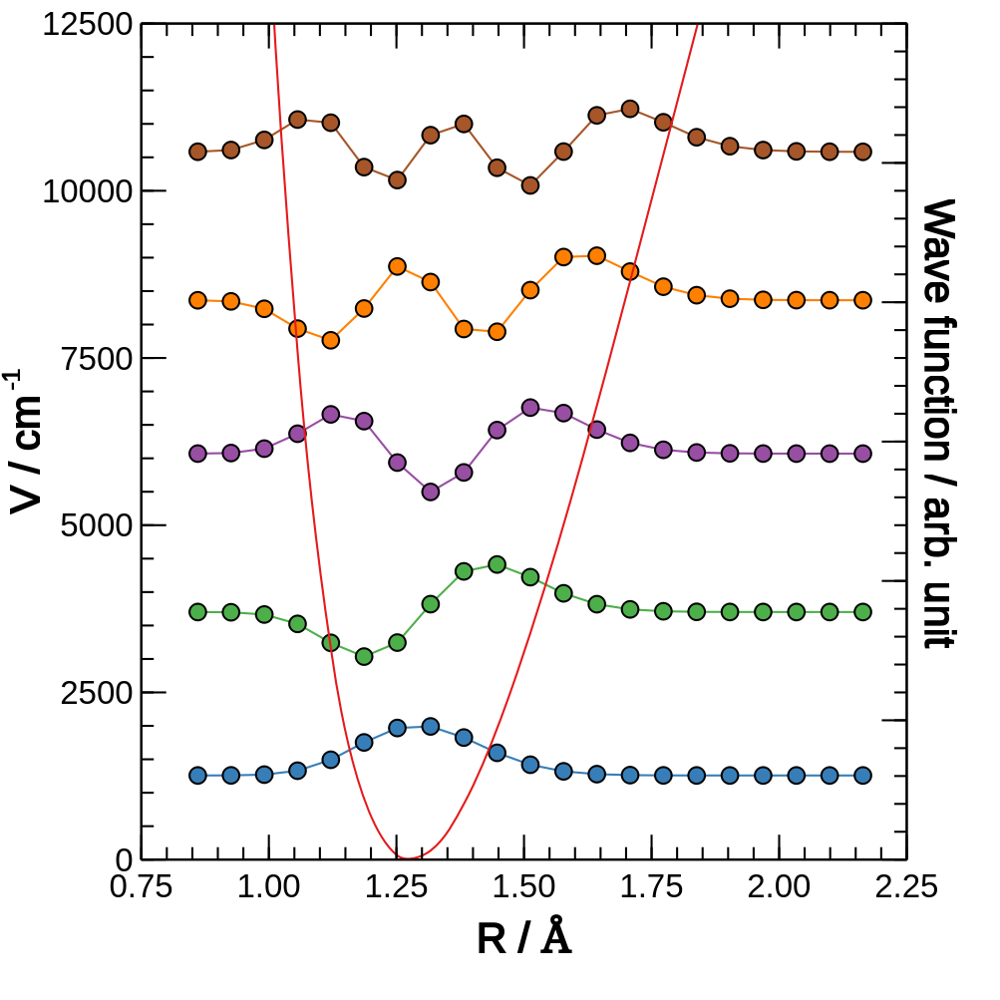

# Quick 1D DVR

An interface of yDVR for non-programmer

Yu Zhai [yuzhai@mail.huiligroup.org](mailto:yuzhai@mail.huiligroup.org)

Jilin University, Changchun, China

## Introduction
You do not have to be a programmer to become an excellent scientist.

The `Quick 1D DVR` code is an interface of part of the functionality of [yDVR](https://github.com/zhaiyusci/ydvr) for non-programmer.

Idea behind the code is to do a sinc-DVR calculation, with automatic converge check, etc.

In current version (v 0.3.0), I will focus on the energy only, 
since sinc-DVR eigenvectors are too large to use directly, in most cases.

## Installation guide

As is said in the Introduction part, it is for the non-programmer, 
thus it is shipped with all its dependencies, 
including a copy of Eigen 3.3.7 and yDVR 2.1.0.

To build it manually, simply type `make` and press `enter`.
As I tested, from `g++-7` on and `clang++-6.0` on (Ubuntu), should work.
A new Ubuntu should shipped with `gcc-9` by default. 
If a C++ compiler is not available, type
```sh
sudo apt install g++-7  # GCC 7 should be available on even an slightly old OS
```
On other systems, similar installation can be done with its own package management.

On Windows or MacOS, tests are not done.
However, in this project, I did not use any OS-specific code so it should be fine.
If any problem occur, raise an issue on Github.

Also I provide a binary version (for Linux) so the user can use it directly.

## Usage
Usage: `/path/to/quick1ddvr <filename>.inp`

The input file should be a plain text file with format shown in `sample/sample_hcl.inp`
`#` is the starting of comments.

In the directory `sample`, input for HCl is given with all the output files.
The users may want these files as a reference.

### Keywords
The following keywords can be used.

#### Varaibles

+ `mass <mass>`, required.
+ `nlevels <n_levels>`, optional, default 5.
+ `threshold`, optional, default 0.1 cm-1.

#### Units

By using this keywrods, you set the unit used in input file,
as well as the std output.
Extra output (eigenvectors, plots), however, will not be affected.

+ `Angstrom`, default.
+ `Bohr`.
+ `Hartree`.
+ `cm-1`, default.
+ `Kelvin`
+ `eV`

#### Potential energy curve
```
pec
<r1>    <V(r1)>
<r2>    <V(r2)>
<r3>    <V(r3)>
...
<ri>    <V(ri)>
...
<rn>    <V(rn)>
endpec
```

## Interesting features

+ Quite a lot of suggestions will be given for the beginners during the execution.
DVR method is (typically) not a dark-box, but I tried to make it one.
+ The output `*.plot.txt` file is aims to give a good input file for plotting.
Use some software like [Veusz](https://veusz.github.io/),
it is easy to draw some textbook-like figure,
with the wave functions fluctuating around its energy level, 
localized in the potential well, like this


## Troubleshooting

+ If you use the binary, chances are that your get a `Kernel too old` error.  
A typically workaround is to compile it yourself.  `make` should work.
+ Please understand that it is your tech guy's responsibility to update the operating system.

## Change log
+ v 0.3.0
Largely optimize I/O.
+ v 0.2.0
Add boundary check mechanism.
+ v 0.1.0
Initial version.


